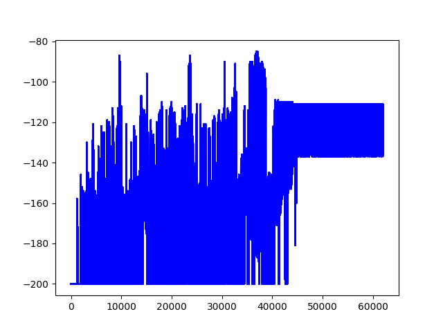
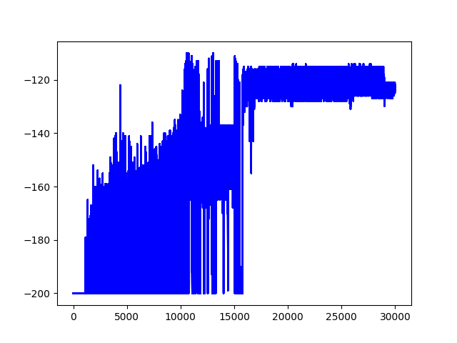

# Let's do Inverse RL

## Introduction

This repository contains PyTorch (v0.4.1) implementations of "Inverse Reinforcement Learning (IRL)" algorithms.

- Apprenticeship Learning via Inverse Reinforcement Learning [[1](#1)]
- Maximum Entropy Inverse Reinforcement Learning [[4](#4)]
- Generative Adversarial Imitation Learning [[5](#5)]
- Variational Discriminator Bottleneck: Improving Imitation Learning, Inverse RL, and GANs by Constraining Information Flow [[7](#7)]

We have implemented and trained the agents with the IRL algorithms using the following environments.

- [OpenAI GYM Mountain car](https://gym.openai.com/envs/MountainCar-v0/)
- [Mujoco Hopper](https://gym.openai.com/envs/Hopper-v2/)
- [Unity ML-Agent Walker](https://github.com/Unity-Technologies/ml-agents/blob/master/docs/Learning-Environment-Examples.md#walker)

For reference, reviews of below papers related to IRL (in Korean) are located in [Let's do Inverse RL Guide](https://reinforcement-learning-kr.github.io/2019/01/22/0_lets-do-irl-guide/).

- [1] [AY. Ng, et al., "Algorithms for Inverse Reinforcement Learning", ICML 2000.](http://ai.stanford.edu/~ang/papers/icml00-irl.pdf) 

- [2] [P. Abbeel, et al., "Apprenticeship Learning via Inverse Reinforcement Learning", ICML 2004.](http://people.eecs.berkeley.edu/~russell/classes/cs294/s11/readings/Abbeel+Ng:2004.pdf)
- [3] [ND. Ratliff, et al., "Maximum Margin Planning", ICML 2006.](https://www.ri.cmu.edu/pub_files/pub4/ratliff_nathan_2006_1/ratliff_nathan_2006_1.pdf)
- [4] [BD. Ziebart, et al., "Maximum Entropy Inverse Reinforcement Learning", AAAI 2008.](http://www.aaai.org/Papers/AAAI/2008/AAAI08-227.pdf)
- [5] [J. Ho, et al., "Generative Adversarial Imitation Learning", NIPS 2016.](https://papers.nips.cc/paper/6391-generative-adversarial-imitation-learning.pdf)
- [6] [XB. Peng, et al., "Variational Discriminator Bottleneck. Improving Imitation Learning, Inverse RL, and GANs by Constraining Information Flow", ICLR 2019.](https://arxiv.org/pdf/1810.00821.pdf)

## Table of Contents

<!-- @import "[TOC]" {cmd="toc" depthFrom=1 depthTo=6 orderedList=false} -->
<!-- code_chunk_output -->

- [Let's do Inverse RL](#lets-do-inverse-rl)
  - [Introduction](#introduction)
  - [Table of Contents](#table-of-contents)
  - [Mountain car](#mountain-car)
    - [1. Information](#1-information)
    - [2. Train](#2-train)
      - [Basic Usage](#basic-usage)
      - [Test the pretrained model](#test-the-pretrained-model)
    - [3. Trained Agent](#3-trained-agent)
  - [Mujoco Hopper](#mujoco-hopper)
    - [1. Installation](#1-installation)
    - [2. Train](#2-train-1)
      - [Basic Usage](#basic-usage-1)
      - [Continue training from the saved checkpoint](#continue-training-from-the-saved-checkpoint)
      - [Test the pretrained model](#test-the-pretrained-model-1)
    - [3. Tensorboard](#3-tensorboard)
    - [4. Trained Agent](#4-trained-agent)
  - [Reference](#reference)
  - [Implementation team members](#implementation-team-members)

<!-- /code_chunk_output -->

## Mountain car

We have implemented `APP`, `MaxEnt` using Q-learning as RL step in `MountainCar-v0` environment.

### 1. Information

- [Mountain car Wiki](https://github.com/openai/gym/wiki/MountainCar-v0)

### 2. Train

If you want to use `APP`, Navigate to `lets-do-irl/mountaincar/app` folder.

If you want to use `MaxEnt` instead of `APP`, Navigate to `lets-do-irl/mountaincar/maxent` folder.

#### Basic Usage

Train the agent wtih `APP`, `MaxEnt` without rendering.

~~~
python main.py
~~~

#### Test the pretrained model

If you want to test `APP`, Test the agent with the saved model `app_q_table.npy` in `app/results` folder.

If you want to test `Maxent` instead of `APP`, Test the agent with the saved model `maxent_q_table.npy` in `maxent/results` folder.

~~~
python test.py
~~~

### 3. Trained Agent

We have trained the agents with two different IRL algortihms using `MountainCar-v0` environment.

| Algorithms | Scores / Episodes | GIF |
|:---:|:---:|:---:|
| APP |  |  |
| MaxEnt |  |  |

## Mujoco Hopper

We have implemented `GAIL`, `VAIL` using PPO as RL step in `Hopper-v2` environment.

### 1. Installation

- [Mac OS (in Korean)](https://dongminlee.tistory.com/38)
- [Ubuntu](https://github.com/reinforcement-learning-kr/pg_travel/wiki/Installing-Mujoco-py-on-Linux)

### 2. Train 

If you want to use `GAIL`, Navigate to `lets-do-irl/mujoco/gail` folder.

If you want to use `VAIL` instead of `GAIL`, Navigate to `lets-do-irl/mujoco/vail` folder.

#### Basic Usage

Train the agent wtih `GAIL`, `VAIL` without rendering.

~~~
python main.py
~~~
* **env**: Ant-v2, HalfCheetah-v2, **Hopper-v2**(default), Humanoid-v2, HumanoidStandup-v2, InvertedPendulum-v2, Reacher-v2, Swimmer-v2, Walker2d-v2

#### Continue training from the saved checkpoint

~~~
python main.py --load_model ckpt_4000.pth.tar
~~~
* Note that `ckpt_4000.pth.tar` file should be in the `lets-do-irl/mujoco/save_model` folder.

#### Test the pretrained model

Test the agent with the saved model `ckpt_4000.pth.tar` in `gail/save_model` folder.

~~~
python test.py --load_model ckpt_4000.pth.tar --iter 5
~~~

Or, Test the agent with the saved model `ckpt_4000.pth.tar` in `vail/save_model` folder.

~~~
python test.py --load_model ckpt_4000.pth.tar --iter 5
~~~

### 3. Tensorboard

Note that the results of trainings are automatically saved in `logs` folder. TensorboardX is the Tensorboard-like visualization tool for Pytorch.

Navigate to the `lets-do-irl/mujoco/gail` or `lets-do-irl/mujoco/vail` folder.

~~~
tensorboard --logdir logs
~~~

### 4. Trained Agent

We have trained the agents with two different IRL algortihms using `Hopper-v2` environment.

| Algorithms | Scores / Episodes | GIF |
|:---:|:---:|:---:|
| PPO (to compare) |  |  |
| GAIL |  |  |
| VAIL |  |  |

## Reference

We referenced the codes from below repositories.

- [Implementation of APP](https://github.com/jangirrishabh/toyCarIRL)
- [Implementation of MaxEnt](https://github.com/MatthewJA/Inverse-Reinforcement-Learning)
- [Pytorch implementation for Policy Gradient algorithms (REINFORCE, NPG, TRPO, PPO)](https://github.com/reinforcement-learning-kr/pg_travel)
- [Pytorch implementation of GAIL](https://github.com/Khrylx/PyTorch-RL)

## Implementation team members

Dongmin Lee : [Github](https://github.com/dongminleeai), [Facebook](https://www.facebook.com/dongminleeai)

Seungje Yoon : [Github](https://github.com/sjYoondeltar), [Facebook](https://www.facebook.com/seungje.yoon)

Seunghyun Lee : [Github](https://github.com/Clyde21c), [Facebook](https://www.facebook.com/Clyde21c)

Geonhee Lee : [Github](https://github.com/Geonhee-LEE), [Facebook](https://www.facebook.com/Geonheeee)